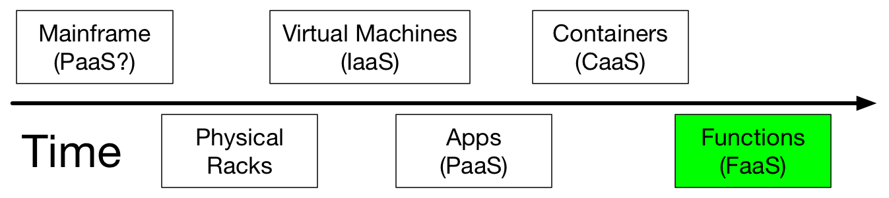
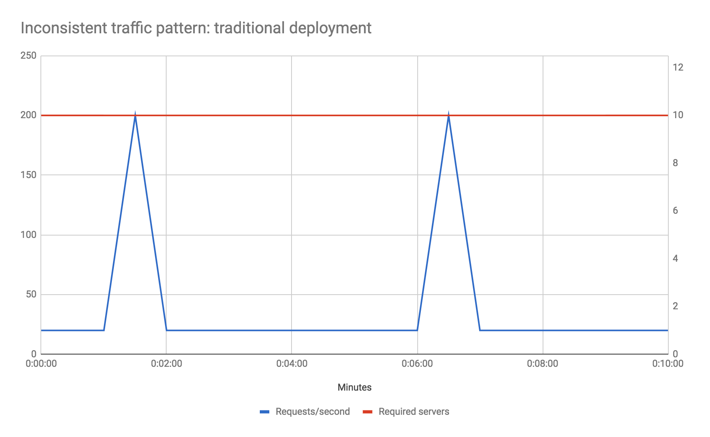
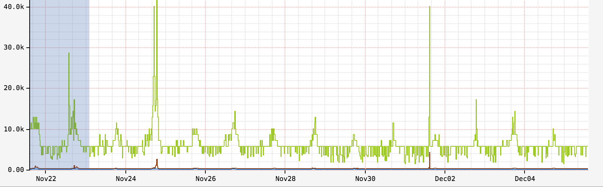

slidenumbers: true

# Serverless Spring

### Jon Schneider, Spring Team (`@jon_k_schneider`)


---

# Serverless is emergent


---

## I don't want you to wind up like this.


---

## Cloud Abstractions



^ Serverless, despite the confusing name, is a style of architecture where we rely on running our own server-side systems as part of our applications to a smaller extent than usual.

---

## A simple Spring Boot "microservice"

```java
@SpringBootApplication
public class HelloMicroserviceApplication {
  @GetMapping("/hello")
  public String hello() {
    return "hello";
  }

  @PostMapping("/uppercase")
  public String uppercase(@RequestBody String input) {
    return input.toUpperCase();
  }

  public static void main(String[] args) {
    SpringApplication.run(HelloFunctionApplication.class, args);
  }
}
```

---

## Spring Cloud Function enables this model.

```java
@FunctionScan
@SpringBootApplication
public class HelloFunctionApplication {
  @Bean
  public Supplier<String> hello() {
    return () -> "hello";
  }

  @Bean
  public Function<String, String> uppercase() {
    return String::toUpperCase;
  }

  public static void main(String[] args) {
    SpringApplication.run(HelloFunctionApplication.class, args);
  }
}
```

---

## Reactive too!

```java
@FunctionScan
@SpringBootApplication
public class HelloFunctionApplication {
  @Bean
    public Function<Flux<String>, Flux<String>> lowercase() {
      return flux -> flux.map(String::toLowerCase);
    }

  public static void main(String[] args) {
    SpringApplication.run(HelloFunctionApplication.class, args);
  }
}
```

---

# [fit] ADVANTAGE: Scaling Costs.



^ 1 request/minute, 50 ms/request, avg CPU usage/hour 0.1%. with FaaS, only pay for 100 ms of compute/minute or 0.15% overall time
^ EC2 reserved t2.nano is $2.63/month or 0.4 cents/hour (1 vCPU + 0.5 GB mem)
^ AWS Lambda priced at 20 cents/1M requests + 8.3 cents per million seconds if function takes 512 MB of ram (plus generous free tier).
^ Notice granularity is at 100ms not 1 hour.

---

# Beyond the initial investment in coding, I can create an almost variable cost business model and redirect investment to maximise returns...

^ Simon Wardley

---

# Variable cost can be achieved at a different resolution.


^ Predictive autoscaling based off of KPIs
^ Horizontal Pod Autoscaling built-in to Kubernetes
^ Superbowl problem!
^ Requires investment in operations engineering -- predictive autoscaling, etc.
^ It's all about utility platforms where you just code, where billing is as granular as possible (e.g. down to the function) and don't give two hoots about "yak shaving" (pointless tasks like capacity planning or racking servers etc). -- Simon Wardley

---

# DISADVANTAGE: Cold starts.



^ might be able to be mitigated with HEDGE REQUESTS (only if idempotent)
^ consider a hypothetical session involving 5 page interactions * 40 resources/page. (edited)
^ 18% of users are going to experience a response time worse than P99.9
^ Only 0.003% of users will _not_ experience something worse than P95
^ 99.9999999999% of users will experience something worse than P50

---

# ADVANTAGE: Reduced operational and development costs.

^ Mainly about doing less "operations" type things
^ Scaling functionality reduces operational management because the scaling is automatic
^ There is one more interesting aspect to mention about FaaS costs: any performance optimizations you make to your code will not only increase the speed of your app, but they’ll have a direct and immediate link to reduction in operational costs

---

# NEUTRAL: Packaging and deployment complexity.

^ With the appropriate deployment automation, these look similar. Fowler identifies this as an advantage to FaaS.

---

# DISADVANTAGE: Monitoring and operational visibility.

^ Made difficult because of ephemerality
^ Immature tooling

---

# ADVANTAGE: Environmental impact.

^ Typical servers in business and enterprise data centers deliver between 5 and 15 percent of their maximum computing output on average over the course of the year. -- Forbes

---

# NEUTRAL: Feedback loop of creating new application components.

^ Depends on how sophisticated your bootstrapping process is.

---

# DISADVANTAGE: Caching.

^ FaaS does allow some use of local cache, and this may be useful assuming your functions are used frequently enough. For instance, with AWS Lambda we typically expect a function instance to stick around for a few hours as long as it’s used at least once every few minutes. That means we can use the (configurable) 3 GB RAM, or 500 GB local “/tmp” space, that Lambda can provide us. For some caches this may be sufficient. Otherwise you will need to no longer assume in-process cache, and you’ll need to use a low-latency external cache like Redis or Memcached. However this requires extra work, and may be prohibitively slow depending on your use case.

---

# CONCLUSION: Both containers and functions have a future.

^ As we see the gap of management and scaling between Serverless FaaS and hosted containers narrow, the choice between them may just come down to style and type of application. For example, it may be that FaaS is seen as a better choice for an event-driven style with few event types per application component, and containers are seen as a better choice for synchronous-request–driven components with many entry points. I expect in a fairly short period of time that many applications and teams will use both architectural approaches, and it will be fascinating to see patterns of such use emerge.
